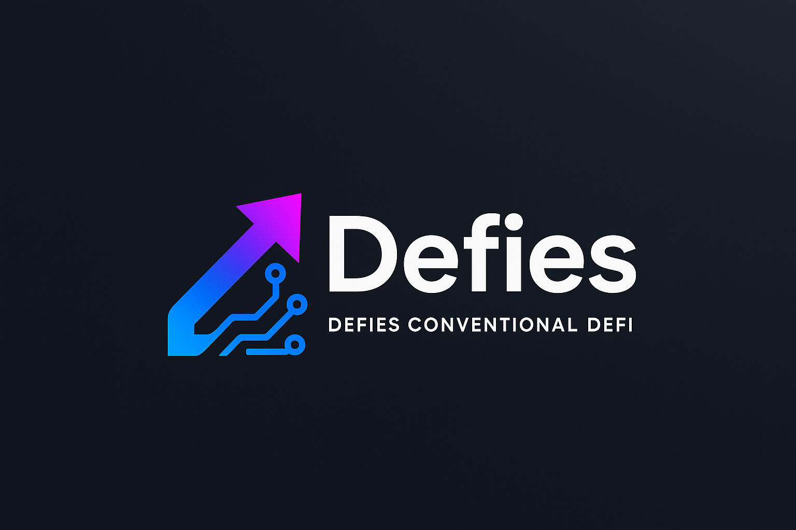
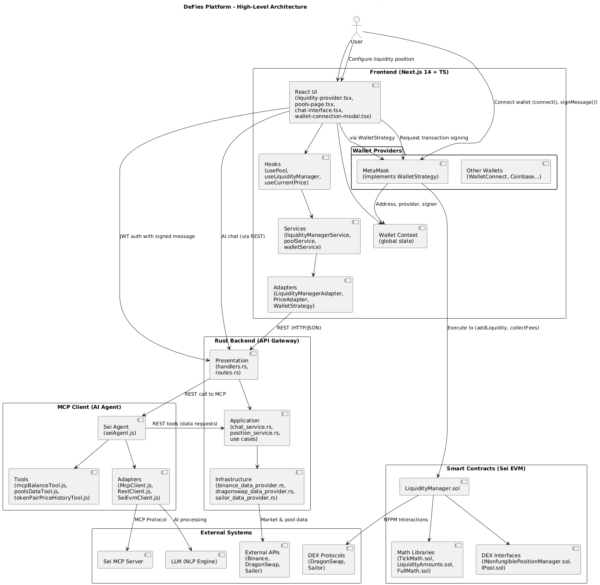
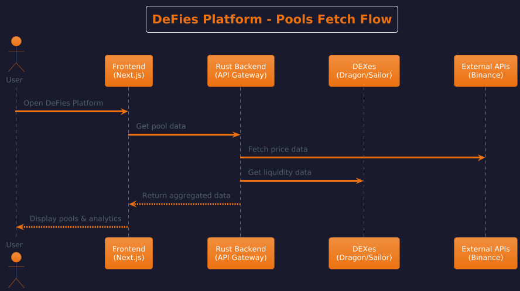
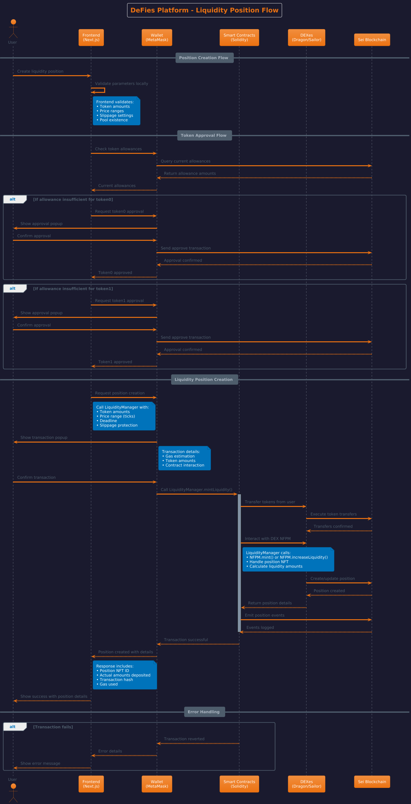
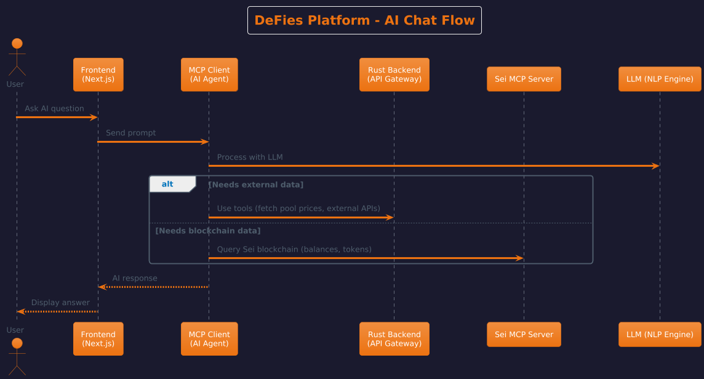

<div align="center">
  
  
  <h1>DeFies - AI-Powered DeFi Platform for Sei Blockchain</h1>
  
  <p><strong>"Making DeFi Easy, Accessible, and Intelligent for Everyone"</strong></p>
  
  <p>
     <a href="https://x.com/SeiDefies" target="_blank">
    
  </a>
    <a href="https://defies.vercel.app/" target="_blank">
      
    </a>
    <a href="https://www.youtube.com/watch?v=JVzZxBK74DI&t=31s" target="_blank">
      
    </a>
    <a href="https://seitrace.com/address/0x36BcE29839Db8DC5cbA2dC64200A729558baB8FD?chain=pacific-1" target="_blank">
      
    </a>
  </p>
  
  <br>
</div>

# DeFies - AI-Powered DeFi Platform for Sei Blockchain

> **Making DeFi Easy, Accessible, and Intelligent for Everyone**

DeFies is a revolutionary AI-powered DeFi platform built specifically for the Sei blockchain ecosystem. We combine artificial intelligence, advanced analytics, and seamless DEX integration to guide users through their DeFi journey with unprecedented ease and intelligence.

## 🌟 Vision

**"Making the world easier for blockchainies"**

We believe DeFi should be accessible to everyone, not just crypto experts. DeFies bridges the gap between complex DeFi protocols and everyday users through AI-powered guidance, intelligent automation, and a unified platform experience.

## 🚀 What is DeFies?

DeFies is an all-in-one DeFi platform that offers:

- **🤖 AI-Powered Chatbot**: Intelligent assistant that understands DeFi and guides users
- **📊 Advanced Analytics**: Real-time insights and personalized recommendations  
- **🔗 DEX Integration**: Direct interaction with multiple DEXes without leaving our platform
- **💰 Smart Liquidity Management**: AI-suggested concentrated liquidity positions
- **🔍 Portfolio Tracking**: Comprehensive balance monitoring
- **🛠️ Developer Tools**: Open-source tools for the Sei ecosystem

## 🏗️ Architecture Overview

DeFies is built with a modern, scalable architecture designed for reliability and performance:

### Component Diagram


## 📦 Project Structure

### 🎨 Frontend (`/frontend`)
**Next.js 14 + TypeScript + Tailwind CSS**

Modern, responsive web interface with advanced DeFi functionality:

```
frontend/
├── app/                     # Next.js App Router
│   ├── globals.css         # Global styles
│   ├── layout.tsx          # Root layout
│   ├── page.tsx            # Home page
│   └── liquidity/          # Liquidity management pages
├── components/             # React components
│   ├── ui/                 # Base UI components
│   ├── liquidity/          # Liquidity-specific components
│   ├── home-page.tsx       # Main landing page
│   ├── liquidity-provider.tsx  # Liquidity interface
│   ├── chat-interface.tsx  # AI chatbot component
│   └── pools-page.tsx      # Pool browsing
├── hooks/                  # Custom React hooks
│   ├── useCurrentPrice.ts  # Real-time price data
│   ├── useLiquidityManager.ts  # Liquidity operations
│   ├── usePool.ts          # Pool data management
│   └── usePools.ts         # Multiple pools handling
├── adapters/               # External service adapters
│   ├── contracts/          # Smart contract interactions
│   ├── apis/               # API communication
│   ├── liquidity/          # Liquidity calculations
│   └── wallet/             # Wallet integrations
├── services/               # Business logic services
├── contexts/               # React contexts (wallet, theme)
├── constants/              # Configuration (networks, DEXes, tokens)
└── types/                  # TypeScript definitions
```

**Key Features:**
- Beautiful, responsive UI with dark theme and gradients
- Real-time price charts and analytics
- Advanced liquidity position management
- Wallet integration (MetaMask, WalletConnect)
- AI chatbot integration
- Multi-DEX support (DragonSwap, Sailor)

### ⚡ Rust Backend (`/rust_backend_api_gateway`)
**Rust + Actix-Web**

High-performance API gateway handling all business logic:

```
rust_backend_api_gateway/
├── src/
│   ├── main.rs             # Application entry point
│   ├── application/        # Application layer
│   │   ├── dtos/           # Data transfer objects
│   │   ├── service/        # Application services
│   │   └── use_cases/      # Business use cases
│   ├── domain/             # Domain layer
│   │   ├── repositories/   # Repository interfaces
│   │   └── services/       # Domain services
│   ├── infrastructure/     # Infrastructure layer
│   │   ├── data/           # Data providers
│   │   ├── external_apis/  # External API integrations
│   │   ├── wallet/         # Wallet services
│   │   └── jwt.rs          # JWT authentication
│   ├── presentation/       # Presentation layer
│   │   ├── handlers.rs     # HTTP handlers
│   │   └── routes.rs       # Route definitions
│   ├── math/               # Mathematical calculations
│   └── config/             # Configuration management
├── migration/              # Database migrations
└── docker-compose.yml      # Docker configuration
```

**Key Features:**
- High-performance Rust backend with Actix-Web
- Clean architecture with layered design
- RESTful API for frontend communication
- Data providers for Binance, DragonSwap, and Sailor
- JWT-based authentication
- Advanced mathematical calculations for DeFi
- External API integrations
- EVM wallet support

### 🤖 MCP Client (`/mcp-client`)
**Node.js + MCP Protocol**

Intelligent AI agent with blockchain tools integration:

```
mcp-client/
├── src/
│   ├── index.js            # Application entry point
│   ├── agent/              # AI agent logic
│   │   └── seiAgent.js     # Sei-specific AI agent
│   ├── config/             # Configuration
│   │   └── env.js          # Environment settings
│   ├── infra/              # Infrastructure adapters
│   │   ├── mcp/            # MCP protocol client
│   │   ├── rest/           # REST API client
│   │   └── sei/            # Sei blockchain client
│   ├── llm/                # Language model integration
│   │   └── LLM.js          # LLM interface
│   ├── server/             # HTTP server
│   │   └── httpServer.js   # Express server setup
│   ├── tools/              # Blockchain tools
│   │   ├── mcpBalanceTool.js       # Balance checking
│   │   ├── mcpTokenBalanceTool.js  # Token balance queries
│   │   ├── poolsDataTool.js        # Pool data retrieval
│   │   └── tokenPairPriceHistoryTool.js  # Price history
│   └── utils/              # Utility functions
│       ├── responseProcessor.js    # Response processing
│       └── tokenRegistry.js       # Token registry
```

**Key Features:**
- MCP (Model Context Protocol) integration
- Communication with Sei MCP server
- Integration with external APIs via Rust backend
- Sei blockchain tools and utilities
- Natural language processing for DeFi queries
- Real-time balance tracking
- Smart recommendations engine
- Token and pool data analysis

### 🔗 Smart Contracts (`/contracts`)
**Solidity + Foundry**

Secure, efficient smart contracts for DEX interactions:

```
contracts/
├── src/
│   ├── LiquidityManager.sol    # Main liquidity management contract
│   ├── Counter.sol             # Example contract
│   ├── interfaces/             # Contract interfaces
│   │   ├── INonfungiblePositionManager.sol
│   │   └── IPool.sol
│   └── libraries/              # Mathematical libraries
│       ├── FixedPoint96.sol
│       ├── FullMath.sol
│       ├── LiquidityAmounts.sol
│       └── TickMath.sol
├── script/                     # Deployment scripts
│   ├── DeployLiquidityManager.s.sol
│   ├── TestMintLiquiidtyDragonUsingNFPM.sol
│   ├── TestMintLiquiidtySailorUsingNFPM.sol
│   └── testMintLqiuidity.s.sol
├── test/                       # Contract tests
│   ├── LiquidityManager.t.sol
│   └── Counter.t.sol
├── examples/                   # Usage examples
│   ├── MintLiquidityExample.sol
│   └── typescript/
└── lib/                        # External libraries
    ├── forge-std/
    └── openzeppelin-contracts/
```
#### 🔗 Deployed Contract Information
**Network:** Sei Pacific-1 (EVM)  
**DeFies LiquidityManager:** [`0x36BcE29839Db8DC5cbA2dC64200A729558baB8FD`](https://seitrace.com/address/0x36BcE29839Db8DC5cbA2dC64200A729558baB8FD?chain=pacific-1)

View contract details, transactions, and verification status on SeiTrace explorer.

**Key Features:**
- Optimized gas usage for Sei blockchain
- Multi-DEX compatibility (DragonSwap, Sailor)
- Advanced liquidity calculations using proven libraries
- Comprehensive test suite with Foundry
- Security-focused design with OpenZeppelin
- Example implementations and TypeScript integration
- Automated deployment scripts

## 🔄 Data Flow & Integration

#### Pool Data Fetching Flow


#### Liquidity Position Creation


#### AI Assistant Interaction



## 🚀 Quick Start

### Prerequisites
- **Node.js** 18+ and **npm/pnpm**
- **Rust** 1.70+ and **Cargo**
- **Foundry** (for smart contracts)

### 1. Clone the Repository
```bash
git clone https://github.com/your-org/defies.git
cd defies
```

### 2. Setup Environment Variables
Copy the example environment files and configure them:

```bash
# Frontend
cp frontend/.env.example frontend/.env

# Rust Backend
cp rust_backend_api_gateway/.env.example rust_backend_api_gateway/.env

# MCP Client
cp mcp-client/.env.example mcp-client/.env
```

### 3. Install Dependencies & Start Services

**Start Rust Backend:**
```bash
cd rust_backend_api_gateway
cargo run
```

**Start MCP Client:**
```bash
cd mcp-client
npm install
npm start
```

**Start Frontend:**
```bash
cd frontend
pnpm install
pnpm dev
```

**Deploy Smart Contracts:**
```bash
cd contracts
forge install
forge build
forge script script/DeployLiquidityManager.s.sol --rpc-url $SEI_RPC_URL --broadcast
```

### 4. Access the Platform
- **Frontend**: http://localhost:3000
- **Rust Backend**: http://localhost:8080
- **MCP Client**: http://localhost:3001

## ✨ Key Features

### 🤖 AI-Powered Assistant
- Natural language DeFi queries
- Real-time balance and portfolio information
- Smart liquidity position recommendations
- Educational guidance and explanations

### 📈 Advanced Analytics
- Real-time price charts and market data
- Liquidity distribution analysis
- Historical performance tracking
- Risk assessment and optimization

### 🔗 Seamless DEX Integration
- Direct integration with DragonSwap and Sailor
- Create liquidity positions without leaving the platform
- Automated transaction handling via smart contracts
- Multi-DEX portfolio management

### 💎 Concentrated Liquidity Management
- AI-suggested optimal price ranges
- Liquidity position creation and management
- Multi-DEX integration (DragonSwap, Sailor)
- Price range configuration tools

## 🛠️ Development

### Running Tests

**Frontend:**
```bash
cd frontend
pnpm test
```

**Rust Backend:**
```bash
cd rust_backend_api_gateway
cargo test
```

**Smart Contracts:**
```bash
cd contracts
forge test
```

### Code Quality

**Rust:**
```bash
cargo fmt      # Format code
cargo clippy   # Lint code
```

**Frontend:**
```bash
pnpm lint      # ESLint
pnpm format    # Prettier
```

## 🤝 Contributing

We welcome contributions! Please see our [Contributing Guidelines](CONTRIBUTING.md) for details on:

- Code style and standards
- Testing requirements
- Pull request process
- Issue reporting

## 🔒 Security

- Smart contracts audited and tested
- Secure wallet integration
- JWT-based authentication
- Input validation and sanitization

## 📄 License

This project is licensed under the MIT License - see the [LICENSE](LICENSE) file for details.

---

<div align="center">

**Making the world easier for blockchainies** 🌍

Built with ❤️ for the Sei ecosystem and the DeFi community

</div>